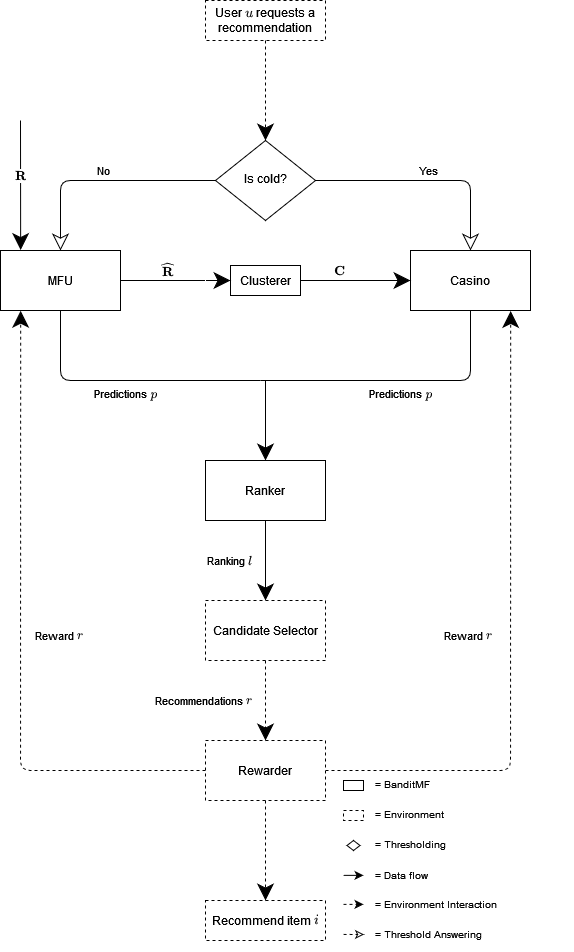

_This repo is a clone of the Azure DevOps repo used while writing my thesis. When the thesis was completed, the code was migrated to [Github](https://github.com/wmeints/Building-a-fair-recommendation-system), to make it publically available. A little over two years later, it was migrated again to [this location](https://github.com/AuckeBos/building-a-fair-recommendation-system), because the original repo was accidentally removed._


# Building a fair recommendation system
This repository contains the code belonging to my thesis, submitted in fulfillment of the 
requirements for the degree of Master of Science in Data Science at the Radboud University.

Please read the [thesis](./thesis.pdf) for a complete overview of:
- The goal of this project
- The results of the project
- The idea behind the system that is created here
- Design choices that were made

## Table of contents
1. [Installation](#installation)
1. [Usage](#usage)
2. [Dataset](#dataset)
3. [Repository structure](#repository-structure)
4. [BanditMF structure](#banditmf-structure)
5. [Simulations](#simulations)
6. [Evaluations](#evaluations)
7. [Tables & Figures](#tables--figures)

## Installation
This project makes use of [Poetry](https://python-poetry.org/); installing requirements 
is easy:
- `pip install poetry` to install poetry
- `poetry install` To create a virtual environment and install packages
- `poetry run python x.py` to run a python script, or `poetry shell` to start a shell that uses 
  the python interpreter of the created env.

## Usage
[`main.py`](banditmf/main.py) is the entrypoint to run BanditMF.

This project is focussed on evaluating the performance and effectiveness. Therefore, BanditMF 
can currently only be ran through evaluators. To do so, alter `main.py` by creating the 
evaluator to be ran, and `evaluate()` it.

If one would like to train and run BanditMF in production, it must be incorporated in an 
Environment. To do so, create a new Environment and override the `reward` and `recommend` 
functions. In these functions connect the environment to the production system, and process user 
feedback and behavior.
## Dataset
The dataset used for this project is [Movielens](https://grouplens.org/datasets/movielens/). 
Evaluations have been ran on the 
[MovieLens Latest Dataset](https://grouplens.org/datasets/movielens/latest/).
The [DataLoader](banditmf/DataLoaders/data_loader.py) assumes that the dataset is downloaded 
from Grouplens, and saved in a folder `data` in the root of this 
project.

## Repository structure
The structure of the project is shown below. The core components of BanditMF are found in the 
[Components](banditmf/Components) directory. The [Environments](banditmf/Environments) directory 
holds environments and simulations. BanditMF is evaluated through so-called 
[Evaluators](banditmf/Evaluators); each of them is discussed in the 
[Evaluations section](#evaluations).

    .
    ├── .flake8                                             # Flake 8 configuration
    ├── .gitignore
    ├── azure-pipelines.yml                                 # Pipeline 
    ├── LICENCE
    ├── mypy.ini                                            # Mypy configuration
    ├── poetry.lock
    ├── pyproject.toml                                      # Package requirements  
    ├── README.md
    ├── banditmf                                            # Source code  
    │   │   helpers.py                                      # Helper functionality  
    │   │   main.py                                         # Endpoint to call  
    │   │
    │   ├── Baselines
    │   │   └── base_baseline.py                            # Abstract baseline  
    │   │   └── popularity_based_recommender.py             # Popularity-based baseline  
    │   │   └── random_recommender.py                       # Random baseline model  
    │   │
    │   ├── Components                                      # BanditMF components  
    │   │   │   bandit_mf.py                                # BanditMF RS  
    │   │   │   casino.py                                    
    │   │   │   clusterer.py
    │   │   │   history_aware_mab.py                        # MAB used in Casino  
    │   │   │   mfu.py                                      # Matrix Factorization Unit  
    │   │   │
    │   │   ├── CandidateSelectors
    │   │   │   │   base_candidate_selector.py              # Abstract base selector  
    │   │   │   │   testset_candidate_selector.py
    │   │   │   └── unrestricted_candidate_selector.py
    │   │   │
    │   │   ├── Rankers
    │   │   │   │   base_ranker.py                          # Abstract base ranker  
    │   │   │   │   default_ranker.py
    │   │   │   └── fair_ranker.py
    │   │   │
    │   │   └── Rewarders
    │   │       │   base_rewarder.py                        # Abstract base rewarder 
    │   │       └── testset_rewarder.py
    │   │
    │   ├── DataLoaders
    │   │   │   cross_validation_generator.py               # Provides create_generator
    │   │   └── data_loader.py                              # Loads movielens 
    │   │
    │   ├── Environments
    │   │   │   base_simulation.py                          # Abstract base simulation 
    │   │   │   batch_simulation.py
    │   │   │   environment.py                             
    │   │   └── prequential_simulation.py
    │   │
    │   ├── Evaluators
    │   │   │   base_evaluator.py                          # Abstract base evaluator 
    │   │   │   baseline_evaluator.py
    │   │   │   batch_simulation_evaluator.py
    │   │   │   cold_user_threshold_evaluator.py
    │   │   │   mab_history_evaluator.py
    │   │   │   mf_vs_casino_evaluator.py
    │   │   │   prequential_simulation_evaluator.py
    │   │   │
    │   │   ├── Fairness
    │   │   │   │   base_fairness_evaluator.py             # Abstract base fairness evaluator 
    │   │   │   │   fairness_evaluator.py
    │   │   │   │   fairness_of_popularity_based_evaluator.py
    │   │   │   └── fairness_vs_effectiveness_evaluator.py
    │   │   │
    │   │   └── HyperparameterSearch
    │   │       │   base_hyperparameter_search.py         # Abstract base hyperparam searcher 
    │   │       │   hyperparameter_search_type_a.py
    │   │       └── hyperparameter_search_type_b.py
    │   │
    │   └── Interfaces
    │       │   algorithm.py                              # Base class for algorithms 
    │       │   predictor.py                              # Base class for predictors 
    │       └── rewardable.py                             # Base class for rewardables 
    │
    └── scripts
        └── long_tail.py                                  # Plots long tail of Movielens

## BanditMF structure
The structure of BanditMF can be found in the figure below. Its components are discussed in the 
thesis. 



## Simulations
A simulation is an environment that simulates user interaction. User interactions consist of two 
parts:
- Requesting a recommmendation. A simulation does this through a testset. A testset consists of 
  tuples `(u(ser), i(tem), r(ating))`, and each tuple is a request of user `u` for a recommendation
- Rewarding a recommendation. In an actual environment, the user feedback (through tracking) is 
  converted into a reward. A simulation rewards through the rating in the testset. Rating `r` is 
  converted to a reward for recommending item `i` to user `u`.

A simulation is used to measure how BanditMF would perform in an actual environment. Two 
different types of simulations are implemented; they differ in the way they reward the system 
and how they measure effectiveness.

### BatchSimulation
A BatchSimulation is a Simulation that uses the users in a testset to  simulate recommendations 
and rewards. The simulation selects all users in the testset, and converts it to a stream of 
users. For each user in the stream, it requests a recommendation and rewards the item that was 
recommended, based on the actual rating of that item in the testset. 

When the simulation has finished, all predicted ratings are split per user. This gives a ranking 
per user. For these rankings the ndcg@k is computed for several k, these are averaged over all 
users for a final effectiveness score.

BatchSimulation is discussed in Section 4.4.3.1 of the thesis.

### PrequentialSimulation
A PrequentialSimulation is a Simulation that uses the ratings in a testset to simulate  
recommendations and rewards. It runs by iterating over the `(u,i,r)` tuples in a testset. For 
each row, it asks the recommender to recommend `k` items. Hence it receives ranking of `k` items; 
this ranking is saved. Then it rewards the recommender with the current row (e.g. it rewards for 
recommending item `i` to user `u` with value `a`). 

When the simulation has finished, a ranking of `k` items exists for each item in the stream. For 
each ranking the ndcg@k is computed, providing an effectivness score over time. The final 
effectiveness score is taken as the last ndcg@k.  

Prequential simulation is discussed in Section 4.4.3.2 of the thesis.

## Evaluations
Each evaluation in [Evaluators](banditmf/Evaluators) is discussed here. We discuss its goal, and 
its usage in the [thesis](thesis.pdf).

### BaselineEvaluator
The BaselineEvaluator performs a K-fold evaluation on the [Baselines](banditmf/Baselines). For
each run, it computes the avg ndcg@k for several k. The results are logged to mlflow.

Two baselines are implemented: The 
[PopularityBasedRecommender](banditmf/Baselines/popularity_based_recommender.py) recommends 
items based on popularity. The [RandomRecommender](banditmf/Baselines/random_recommender.py) 
recommends random items. Their performance is evaluated using Prequential evaluation.

The results of this evaluation are used in the thesis: Section 4.4.5.2 and Section 4.4.5.3 
discuss the performance of the popularity-based baseline and the random baseline respectively.

###BatchSimulationEvaluator
The BatchSimulationEvaluator runs K-fold on a BatchSimulation. After each simulation, it computes 
nDCG@k for several k.
  
The nDCGs are computed as follows. After the simulation is finished, the results 
are split per user. For each user this results in a ranking of items. For each of 
these rankings, the ndcg@k is computed for some k's. The nDCGs are averaged
over all users and then over all splits. The result is an avg nDCG@k for each k
  
This evaluation is used in the thesis: Section 4.4.3.1 discusses the BatchSimulation, which is 
the one used in this evaluator. The results in Section 4.4.4.1 are retrieved through this evaluator.

### ColdUserThresholdEvaluator
The ColdUserThresholdEvaluator is used to investigate the percentage of users that switches from 
cold to non cold within one testset. It uses leave 1 out a number of times. Hence each split has a 
testset that contains all ratings of 1 user. The stream is iterated, and the switch moment for 
the user is saved. The results are printed to stdout

The results of this evaluation are not used in the thesis, but rather used to manually investigate 
the behavior of BanditMF. This behavior was used to decide upon the mechanism for certainty of 
the Casino

### MabHistoryEvaluator
The MabHistoryEvaluator is used to investigate the history of the MABs of the casino. It uses 
the history that is saved in the HistoryAwareMAB class to create matplotlib plots.

The evaluator selects a number of users as testset. Then it runs a BatchSimulation on the sorted 
stream. Whenever a user switches from cold to non-cold, a plot is created and shown. The plot 
shows the history of the MAB of that user.

The results of this evaluation are not used in the thesis, but rather used to manually investigate
the behavior of BanditMF. This behavior was used to decide upon the mechanism for certainty of 
the Casino

### MFVsCasinoEvaluator
The MfVsCasinoEvaluator runs two RatingStreamSimulations a number of times times, where each run 
has a testset of some users. One simulation simulates BanditMF that always uses MF, one 
simulation simulates  BanditMF that always uses the Casino.

The goal of this evaluator is to compare MF with BanditMF. 

This evaluation is used in the thesis: Section 4.4.5.1 discusses the comparison to the MF 
baseline. Its results are retrieved through this evaluator.

### PrequentialSimulationEvaluation
The PrequentialSimulationEvaluator runs K-fold on the PrequentialSimulation. The results are 
averaged and logged to mlflow.
   
The scores of each run are plotted over time. Eg the result is a line plot 
(through MLflow) of ndcg@k for each timestep. The total number of timesteps is
the number of ratings in the testset.  
  
This evaluation is used in the thesis: Section 4.4.3.2 discusses the PrequentialSimulation, 
which is the one used in this evaluator. The results, as discussed in Section 4.4.4.2, are 
created using this evaluator.  This evaluator can also create plots of ndcg@10 over time. Such 
plots are shown in the thesis: Figures 4.8 and 4.9. 

This evaluator runs the PrequentialSimulation as discussed above. The results of Section 4.4.4.2 of
the thesis are retrieved through this Evaluator.

### Hyperparameter search
The hyperparameter search is an evaluation method to a) find the best hyperparameter combination 
and b) measure performance of BanditMF. Two different searches are done, corresponding to the 
two different simulations.

Both evaluations use K-fold cross validation. The results in the thesis are retrieved by 
averaging over all folds. 
#### Search through batch evaluation: [HyperparameterSearchTypeA](banditmf/Evaluators/HyperparameterSearch/hyperparameter_search_type_a.py)
The HyperparameterSearch of type A optimizes the ndcg@k for different ks. The
ndcg is computed over the rankings deduced after a complete simulation. It uses
the BatchSimulation.

The score is computed as follows: The evaluation computes ndcg@k for some k.
The used rankings for the ndcg is the list of recommendations as a result of the simulation for 
that user. The ndcgs are averaged over all users, and then over all splits. Hence for each run
we have ndcg@k for each k. The final score is the average of the ndcg@k for a specific k. The 
loss is 1 - this value.

This evaluation is used in the thesis: Section 4.4.3.1 discusses the BatchSimulation, which is 
the one used in this evaluator. Section 4.4.4.1 shows the results.
#### Search through prequential evaluation: [HyperparameterSearchTypeB](banditmf/Evaluators/HyperparameterSearch/hyperparameter_search_type_b.py)
The HyperparameterSearch of type B optimizes the hyperparameters using ndcg@k
for each timestep. It uses the PrequentialSimulation. For each item in the
testset, and computes ndcg@k for the recommendations that the RS makes at
that time. 
The final score for a hyperparameter combination is averaged over each split.
for each split it computes the running average ndcg@k; the final score is the average ndcg@k 
over the last `window` timesteps. The loss is 1 - this score.

This evaluation is used in the thesis: Section 4.4.3.2 discusses the PrequentialSimulation, 
which is the one used in this evaluator. Section 4.4.4.2 shows the results.
### Fairness evaluation
Three fairness evaluators exist. They are used to measure the fairness in terms of APT of 
popularity-based ranking and of BanditMF. Used in Section 4.5 and 4.6 of the thesis.
#### FairnessEvaluator
The FairnessEvaluator runs K-fold on a PrequentialSimulation. After each simulation, it computes 
the fairness at each timestep, and logs it to mlflow.    

This evaluator is used in the thesis: Section 4.5.1 discusses the fairness of BanditMF.
#### FairnessOfPopularityBasedEvaluator
The FairnessOfPopularityBasedEvaluator evaluates the fairness of the baseline PopularityBased 
recommender through k-fold cross-validation.
    
The results of this evaluation are not used in the thesis, but rather used for 
manual investigating behavior
#### FairnessVsEffectivenessEvaluator
The FairnessVsEffectivenessEvaluator measures the balance between effectiveness
and fairness. It uses the FairRanker to create a ranker that is fair to some
extent:
```
Create RUN_COUNT splits. Each testset has USER_COUNT users
For p in PS:
    create FairRanker with p=p
    start child run
    For each tr,te split:
        run simulation, save apt and ndcg
    compute avg apt
    save
save all apt and ndcg for each p in mlflow
```
The plots of this evaluation are shown in the thesis: Section 4.6.2.2 shows the nDCG vs APT plot.

## Tables & Figures
This section describes for all tables and girues in the [thesis](thesis.pdf) how it is created.
- The figures in Chapter 2 are manually created, using [DrawIo](https://app.diagrams.net/).
- The tables in Chapter 2 are manually created, using the conclusions of the corresponding chapters.
- Figure 4.1 shows the structure of BanditMF. It is created using the source code.
- Figure 4.2 shows the splitting mechanism that is used, it is implemented in the DataLoader.
- Figure 4.3 shows the training procedure, e.g. the `fit` functions of the components of BanditMF.
- Figure 4.4 shows the testing procedure as implemented in the
  [Environments](banditmf/Environments) and [Evaluators](banditmf/Evaluators).
- Figure 4.5 shows the [BatchSimulation](banditmf/Environments/batch_simulation.py) procedure.
- Figure 4.6 shows the [PrequentialSimulation](banditmf/Environments/prequential_simulation.py) 
  procedure.
- Table 4.1 shows the results of the BatchSimulation. It is created by the results in
  [mlflow](https://www.mlflow.org/).
- Table 4.2 shows the Pearson Correlation of the results of Table 4.1. It is created using the 
  [`corrcoef`](https://numpy.org/doc/stable/reference/generated/numpy.corrcoef.html) function of 
  NumPy.
- Table 4.3 shows the results of the PrequentialSimulation. It is created by the results in mlflow.
- Figure 4.7 and Figure 4.8 show the nDCG@10 over time for a run of the PrequentialEvaluation. 
  They are created using the `plot_run` function of that evaluator.
- Figure 4.9 shows the effectiveness of BanditMF and MF. It is created using the `plot_run` 
  function of the [MfVsCasinoEvaluator](banditmf/Evaluators/mf_vs_casino_evaluator.py).
- Figure 4.10 shows the long tail of MovieLens. It is created using the
  [long_tail.py](scripts/long_tail.py) script.
- Figure 4.11 shows the fairness evaluation method.
- Figures 4.12 and 4.13 show the effectiveness and fairness for a run of the 
  FairnessVsEffectivenessEvaluator. It is created using the `plot_run` function of that evaluator. 
- Figure 4.14 shows the effectiveness vs fairness tradeoff. It is created using the `plot_run` 
  function of the FairnessVsEffectivenessEvaluator.
